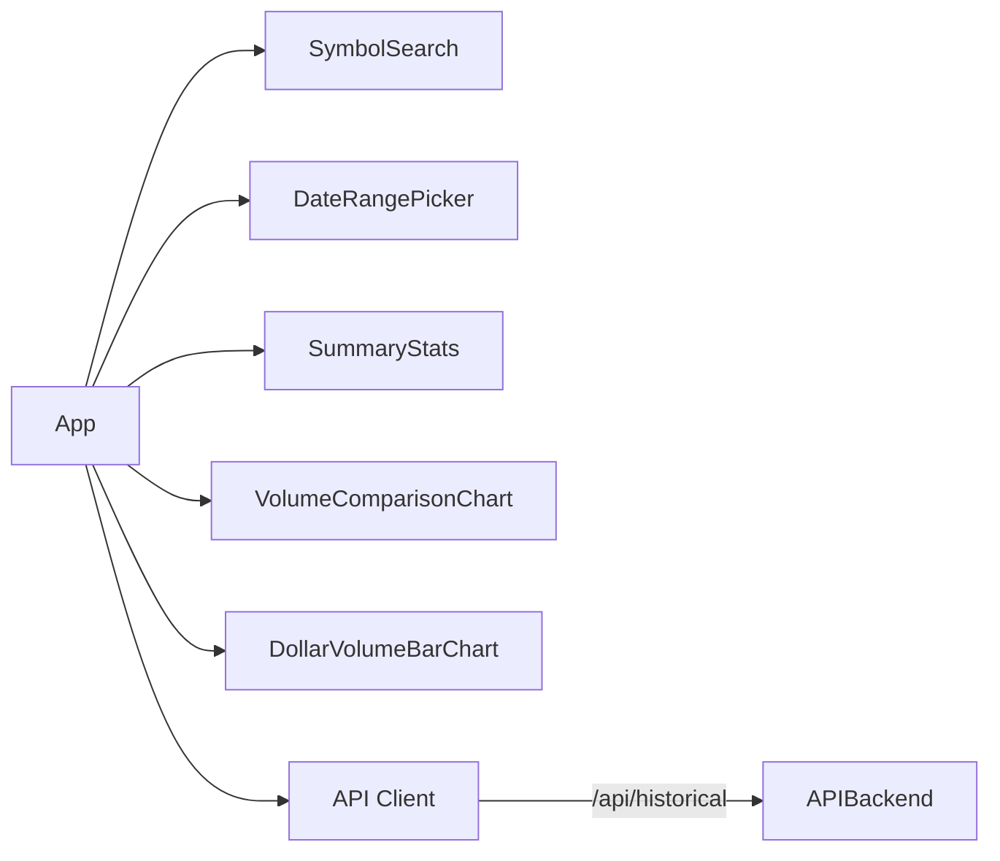
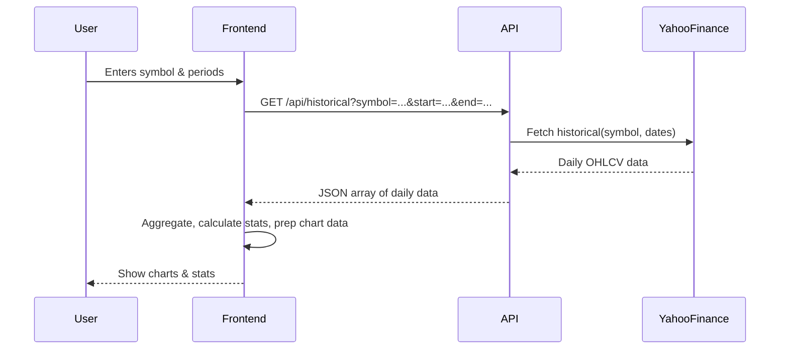

# Stock Volume Analyzer — Requirements & Technical Design

---

## 1. Project Overview

The Stock Volume Analyzer is a modern web application enabling users to analyze and compare stock trading and dollar volumes for US and Canadian equities. It fetches live historical data from Yahoo Finance and provides interactive visualizations, summary statistics, and a responsive UI.

---

## 2. Objectives
- Compare two custom time periods for any stock symbol
- Fetch real-time historical trading data (volume, price)
- Visualize volume/dollar volume metrics and trends
- Show summary stats for easy comparison
- Deliver a fast, intuitive, and device-responsive experience

---

## 3. Requirements

### 3.1 User Stories
- **US1:** Enter a stock symbol and fetch data
- **US2:** Compare trading/dollar volume between two periods
- **US3:** Visualize daily volumes (line chart)
- **US4:** Visualize monthly dollar volume (bar chart)
- **US5:** See summary stats (total, average, change)
- **US6:** Refresh or update data anytime
- **US7:** Support US and Canadian stocks
- **US8:** Mobile/desktop compatibility
- **US9:** Easy maintainability and deployment

### 3.2 Functional Requirements
- Input/search any valid stock symbol
- Set two date ranges for comparison
- Fetch historical OHLCV from Yahoo Finance for both ranges
- Calculate daily, monthly, and summary stats
- Display:
    - Line chart: Daily volume (both periods)
    - Bar chart: Monthly dollar volume
    - Summary stats: grid/cards
- Graceful error/loading states

### 3.3 Non-Functional Requirements
- <2s data update for standard queries
- No login/auth
- Graceful error handling
- Vercel deployment, no external backend needed
- Modular, extensible codebase

---

## 4. Architecture Overview

```mermaid
graph TD;
    User-->|inputs symbol & periods|Frontend[React UI]
    Frontend-->|API call|API[/api/historical.js (Vercel)]
    API-->|fetches|Yahoo[Yahoo Finance API]
    Yahoo-->|data|API
    API-->|returns|Frontend
    Frontend-->|renders|Charts
    Frontend-->|renders|SummaryStats
```

---

## 5. Technology Stack
- **Frontend:** React (Vite)
- **Styling:** CSS, optionally TailwindCSS
- **Charts:** Recharts
- **Dates:** date-fns
- **HTTP Client:** Axios
- **API Backend:** Vercel serverless function (`/api/historical.js`)
- **Data Source:** yahoo-finance2 npm package
- **Hosting:** Vercel

---

## 6. Component Breakdown



- **App:** Main controller
- **SymbolSearch:** Input/select stock symbol
- **DateRangePicker:** Pick two date ranges
- **SummaryStats:** Total/average/max/% change
- **VolumeComparisonChart:** Daily volume, 2 lines
- **DollarVolumeBarChart:** Monthly dollar volume
- **API Client:** Axios fetch to backend API
- **API Backend:** Serverless function with Yahoo Finance fetch

---

## 7. API & Data Flow

### Sequence Diagram



---

## 8. Data Models

### API Request
```
GET /api/historical?symbol=ETG.TO&start=2023-01-01&end=2023-12-31
```

### API Response
```json
[
  { "date": "2024-04-01", "open": 13.5, "close": 14.0, "high": 14.2, "low": 13.4, "volume": 20000 },
  ...
]
```

### Frontend State Example
```js
{
  symbol: "ETG.TO",
  periods: {
    period1: { start: "2023-04-01", end: "2023-12-31" },
    period2: { start: "2024-04-01", end: "2024-12-31" }
  },
  data: {
    period1: [...],
    period2: [...]
  }
}
```

---

## 9. UI/UX Design

### Wireframe

```
+-----------------------------------------------------+
|  Stock Trading Volume & Dollar Volume Analyzer       |
+-----------------------------------------------------+
| [Symbol] [Period 1 Range] [Period 2 Range] [Refresh]|
+-----------------------------------------------------+
| [ Summary Cards: Volumes, Averages, % Change, Max ] |
+-----------------------------------------------------+
| [Line Chart: Daily Volume Comparison]               |
+-----------------------------------------------------+
| [Bar Chart: Monthly Dollar Volume Comparison]        |
+-----------------------------------------------------+
```

### Color/Chart Example
- Two lines in chart (one for each period, e.g., black and teal)
- Monthly bars in different colors per period
- Hover shows value for both periods
- Loading/error indicators below controls

---

## 10. Error Handling & Validation
- Show user-friendly error on invalid symbol or data
- Disable refresh button during loading
- Warn if no data in selected date range
- Handle API/network failure gracefully
- Prevent selecting end before start date

---

## 11. Deployment & CI/CD
- **Vercel integration:** Connect GitHub, import project, auto-deploy on push
- **Build command:** `vite build`
- **Output directory:** `dist`
- **API directory:** `/api` (Vercel auto-detects)
- **Zero secrets needed** (all public data)

---

## 12. Future Roadmap
- Symbol autocomplete and search
- Export chart/data as CSV/PNG
- Add more chart types (price, volatility, etc.)
- Allow multi-symbol comparison
- Dark mode

---

## 13. Appendix: File Structure

```
stock-analyzer/
├── api/
│   └── historical.js
├── src/
│   ├── App.jsx
│   ├── main.jsx
│   ├── components/
│   │   ├── SymbolSearch.jsx
│   │   ├── DateRangePicker.jsx
│   │   ├── VolumeComparisonChart.jsx
│   │   ├── DollarVolumeBarChart.jsx
│   │   └── SummaryStats.jsx
│   ├── utils/
│   │   └── api.js
│   └── index.css
├── index.html
├── package.json
├── vite.config.js
├── README.md
```
